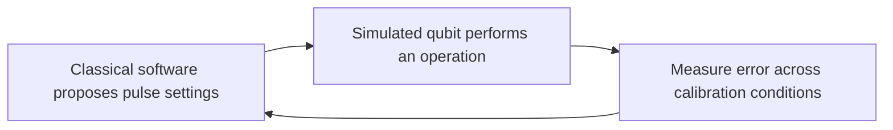

# Quantum Bridge Lab

**Testing whether AI can make quantum control more efficient.**

Quantum computers need carefully chosen control signals to perform useful operations. This project asks a focused question: **can a language model find better control settings than a conventional optimizer when both receive the same number of trials?**

The first experiment uses a simulated qubit, the basic unit of a quantum computer. This repository brings together the research plan, Python software and review history needed to make the answer inspectable.

**Status:** Offline implementation and verification. The experiment has not run, and its final execution plan is not frozen. The latest completed milestone passed [607 tests](research/counted-admission/VERIFICATION.md) using analytic identities, fabricated data and mock provider responses. Performance results will follow a separately authorized, recorded experiment.

## The quantum–classical bridge

Classical software chooses a sequence of control pulses. A quantum-system simulator measures how well those pulses perform the desired operation. The software uses that feedback to choose its next settings.



All computations in this first study run on a classical computer. The quantum part is a mathematical model of a qubit. The bridge we are investigating is the feedback between a classical decision method and quantum-control requirements.

Imagine tuning a radio with several connected knobs. You try some settings, listen to the result, and use what you learned to choose the next settings. Here, the “knobs” set the pulses, and the score measures how closely the simulated qubit performs a target operation despite specified calibration errors.

## What we are testing

A language model receives earlier settings and scores, then proposes ten new settings at a time. We compare it with **CMA-ES**, an established method for improving numerical settings, and **random search**, a simple reference.

- Each method receives **200 evaluation slots per run**, including the same ten starting points.
- The plan uses **two groups of 20 paired runs**, with both groups completed before the final comparison is revealed.
- The analysis and failure rules are written in advance. The success criterion requires evidence for at least a **twofold improvement in typical final error over the configured CMA-ES baseline**, independently in both groups, with the validity checks satisfied. The comparison treats errors below a fixed numerical floor as equal, so improvements beneath that floor are outside this claim.
- We also record time, model usage, failed attempts and costs. Equal trial budgets can require different amounts of these resources.

The [research protocol](specification/ai_quantum_control_protocol_v0.4.md) defines the exact statistical criterion. A [proposed amendment](research/counted-admission/STATUS.md) addresses prompt counting, request accounting and observable model identity; it has not yet been adopted.

## Why pursue it?

Finding reliable control settings is one place where classical computation can support quantum systems. A small, inspectable comparison can help determine whether language models deserve further investigation for that work.

The immediate contribution is a transparent test: inspectable assumptions, a conventional comparison, preserved failures and an analysis fixed before results. Researchers in quantum control, applied AI and numerical optimization can inspect or extend it. Builders and learners can follow a concrete example of how to turn a broad AI claim into a testable question.

Our current judgment is that this is worth a bounded research effort. The decision to fund model calls depends on verified costs and the value of the answer. See the [pursuit decision and retained reviewer disagreements](research/PURSUIT_DECISION.md).

## If the experiment succeeds

A positive result would show that this model, request strategy and trial budget improved control search on this particular simulated task. That would support testing harder control problems, different calibration conditions and additional models, followed by collaboration with quantum-hardware teams.

The longer-term opportunity is software that helps researchers find useful quantum-control settings with fewer costly trials. Demonstrating hardware savings, reliable scaling and commercial value would each require further evidence. We will publish a null or inconclusive outcome with the same care as a positive one so others can judge where further investment is justified.

## Explore the repository

| Start here | What you will find |
| --- | --- |
| [Current implementation status](research/counted-admission/STATUS.md) | Completed checks, proposed changes and remaining gates |
| [Research protocol](specification/ai_quantum_control_protocol_v0.4.md) | The physical task, comparison, failure rules and analysis |
| [Python components](src/qbridge/) | Simulation building blocks, proposal parsing, trial accounting and locked analysis |
| [Tests](tests/) and [verification evidence](research/counted-admission/VERIFICATION.md) | Analytic and fabricated-data checks, with their scope and limitations |
| [Research and reviews](research/) | Sources, decisions, independent challenges and synchronization records |
| [Original sources](sources/original/) | Earlier designs and Claude Science reviews, preserved unchanged |

Codex and Claude Science develop and challenge the work under Chris Dukes's direction. Agreement between assistants is review input; experimental evidence must come from the recorded study. The [Linear project](https://linear.app/cld-maindev/project/quantum-bridge-lab-cc3b6e3fff04) tracks progress, and this repository provides the research record for readers without Linear access.

## Try the offline checks

Use macOS or Linux, Python 3.11 and [uv](https://docs.astral.sh/uv/). From a source checkout:

```sh
git clone https://github.com/clduab11/quantum-bridge-lab.git
cd quantum-bridge-lab
uv sync --frozen
PYTHONPATH=src PYTEST_DISABLE_PLUGIN_AUTOLOAD=1 uv run --frozen pytest -q
uv run --frozen ruff check src tests analysis
PYTHONPATH=src uv run --frozen python -m qbridge.preflight --output-dir preflight-output
```

These commands check the selected checkout's core suite. Work under review may be on a research branch; see the [pull requests](https://github.com/clduab11/quantum-bridge-lab/pulls). The 607-test milestone also includes separately preserved candidate packages; its [verification guide](research/counted-admission/VERIFICATION.md) gives the full command and dependency environment.

No model API key is needed. The final command requires a new output directory and saves tested inputs, logs and an engineering report. It runs analytic identities and fabricated-data checks, including a constant-score optimizer fixture. It evaluates no candidate on the study objective and makes no experimental model call. The checks provide no network sandbox.

The process executor requires a single-threaded POSIX caller, and callbacks must not detach into new sessions. Local cancellation cannot cancel work already accepted by a remote provider. `InlineExecutor` is for synthetic timing fixtures only.

## Roadmap

1. Build the bounded preflight entry point around the reviewed provider and [fixed fabricated inputs](research/counted-admission/e9-inputs/README.md), and record the prospective amendment decision.
2. Verify billing and record numeric spending authority, then run the bounded model preflight. Complete the study launcher and remaining readiness checks before freezing the full execution plan.
3. Run both study stages, apply the locked analysis and publish the result with its costs and limitations.
4. Use the evidence to decide whether harder simulations and eventual hardware collaboration are justified.

[Protected storage and automated custody roles](research/execution-preparation/operational-setup.json) are already recorded. There is currently no command that launches the full experiment, and independent evaluator blinding is not established. [Request budgets](research/counted-admission/BUDGET.md) retain an unknown total while counting fees are unverified. Observable model metadata can reveal some provider changes; undetectable changes remain a limitation.

Scientific changes must be recorded before observations can influence them. Historical reviews describe their own point in time. Study transcripts, results and private comparison mappings stay outside public engineering artifacts until an appropriate release is prepared.
