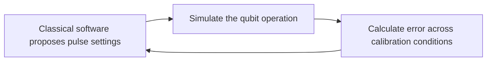

# Quantum Bridge Lab

Quantum Bridge Lab tests whether a language model can find better control settings for a simulated qubit than a numerical optimizer given the same trial allowance. A qubit is the basic unit of a quantum computer; this experiment models one in Python.

The experiment has not run. The software passed [607 offline tests](research/counted-admission/VERIFICATION.md), using analytic identities, fabricated data and mock API responses. The final execution plan is still under review.

## How it works

A control pulse changes a qubit's state. Small calibration errors can make the resulting operation differ from the one intended. The task here is to choose pulse settings that keep that error small across a specified set of calibration conditions.

Think of tuning a radio with several connected knobs: try settings, check the result, then choose what to try next. In this experiment, the simulator supplies a numerical error score instead of sound.



This feedback loop is the quantum–classical connection in the project. The first study runs entirely on a classical computer. It uses no quantum hardware.

## The comparison

The language model receives previous settings and scores, then proposes ten new settings at a time. Its competitors are CMA-ES, a numerical optimization method, and random search.

Each method gets 200 evaluation slots per run, including the same ten starting points. There are two stages of 20 paired runs. Both stages finish before the final comparison is revealed.

The success criterion requires statistical evidence that, in a typical paired comparison, the model's final error is less than half the error from the configured CMA-ES baseline. This must hold in each stage. Errors below a fixed numerical floor count as equal. The validity checks must also pass. The [protocol](specification/ai_quantum_control_protocol_v0.4.md) gives the exact criterion and failure rules.

We record time, API usage and costs as well as error. Equal trial allowances do not imply equal computing costs. A [proposed amendment](research/counted-admission/STATUS.md) adds exact prompt counting and revised model-identity checks; it has not been adopted.

## What a result would tell us

A positive result would apply to this model, pulse-search method and simulated task. It would justify a follow-up on harder control problems. Whether the method saves trials on quantum hardware would need a hardware experiment.

The possible application is calibration software that finds useful control settings with fewer measurements. To make that a product, a later study would have to show that measurement savings outweigh model costs and that the method works reliably beyond this one-qubit simulation. This repository has no evidence for those claims yet.

A negative or inconclusive result will also be published. It can help researchers decide whether to keep investigating this particular use of a language model. The [pursuit decision](research/PURSUIT_DECISION.md) explains why we are continuing the engineering work and records disagreements from the review.

## Use the work

Quantum-control researchers can inspect the simulator and comparison. Optimization researchers can examine the evaluation budget and failure accounting. Readers learning about the topic can start with the protocol's physical setup and follow the tests.

| File or directory | Contents |
| --- | --- |
| [Current status](research/counted-admission/STATUS.md) | Completed work and remaining requirements |
| [Protocol](specification/ai_quantum_control_protocol_v0.4.md) | Physical task, comparison and analysis rules |
| [Python source](src/qbridge/) | Simulator, proposal parser, trial accounting and analysis |
| [Verification](research/counted-admission/VERIFICATION.md) | Commands, test results and limitations |
| [Costs](research/counted-admission/COST_BRIEF.md) | Who is paid, conditional calculations and budget approval |
| [Research](research/) | Sources, decisions and reviews |
| [Original documents](sources/original/) | Earlier designs and Claude Science reviews |

Codex and Claude Science write and review the code and documents under Chris Dukes's direction. Their reviews do not establish experimental performance. Work is tracked in [Linear](https://linear.app/cld-maindev/project/quantum-bridge-lab-cc3b6e3fff04); the research record is available here without a Linear account.

## Run the offline checks

Use macOS or Linux, Python 3.11 and [uv](https://docs.astral.sh/uv/). From a source checkout:

```sh
git clone https://github.com/clduab11/quantum-bridge-lab.git
cd quantum-bridge-lab
uv sync --frozen
PYTHONPATH=src PYTEST_DISABLE_PLUGIN_AUTOLOAD=1 uv run --frozen pytest -q
uv run --frozen ruff check src tests analysis
PYTHONPATH=src uv run --frozen python -m qbridge.preflight --output-dir preflight-output
```

These commands check the selected checkout's core suite. Current work may be on a research branch; see the [pull requests](https://github.com/clduab11/quantum-bridge-lab/pulls). The [607-test verification guide](research/counted-admission/VERIFICATION.md) includes the additional candidate packages and their separate dependency environment.

No model API key is needed. The final command requires a new output directory and saves inputs, logs and an engineering report. It checks analytic identities and fabricated data, including a constant-score optimizer fixture. It makes no experimental model call and evaluates no candidate on the study objective. These checks do not provide a network sandbox.

The process executor requires a single-threaded POSIX caller; callbacks must not detach into new sessions. Local cancellation cannot cancel a request already accepted by a remote provider. `InlineExecutor` is for synthetic timing fixtures only.

## Next steps

1. Finish the bounded model-preflight launcher using the [fixed fabricated inputs](research/counted-admission/e9-inputs/README.md), and record the amendment decision.
2. Verify billing and approve a numeric preflight budget. Run the model preflight, complete the study launcher and freeze the full execution plan after the remaining checks pass.
3. Run both study stages and publish the analysis, failures and costs.

The complete experiment has no launch command yet. [Protected storage and automated custody roles](research/execution-preparation/operational-setup.json) are recorded, but independent evaluator blinding is not established. [Budget calculations](research/counted-admission/BUDGET.md) leave the total unknown while counting fees remain unverified. Model metadata can reveal some provider changes; changes that leave it unchanged may go undetected.

Study transcripts and private comparison mappings will stay outside public engineering artifacts until a release is prepared. Scientific changes must be recorded before observations can influence them.
